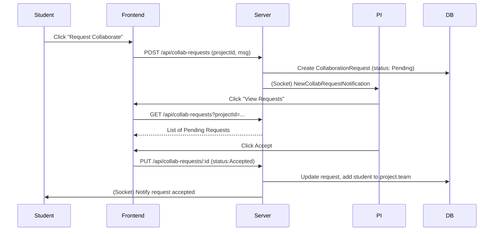

# ResearchHub: Research Collaboration Platform (MERN) – Product Requirements Document

## Executive Summary

ResearchHub is a comprehensive MERN-stack web platform enabling students, faculty, and principal investigators (PIs) to discover research projects, share data, and collaborate efficiently. It centralises project listings, user profiles, datasets, milestones, and publications. Students can find projects matching their skills; faculty and PIs can create projects, manage teams, and track progress; administrators oversee roles and department portfolios. Key differentiators include advanced search (by domain, skills, department), role-based access control (RBAC), file sharing (datasets/publications), real-time features (notifications/chat), and AI-powered recommendations. The solution will be designed following best practices: secure JWT/OAuth authentication, responsive React UI with Tailwind CSS, RESTful Node/Express API, MongoDB Atlas with search, and cloud deployment. This PRD details user personas, functional/non-functional requirements, data models, API designs, UI/UX outlines, integrations (Cloudinary/S3, Atlas Search, Google OAuth, Gemini API, Socket.io), deployment, testing, observability, roadmap, KPIs, risks, and resume-worthy highlights.

## Purpose & Scope

- **Purpose:** Facilitate research collaboration by connecting researchers (students, faculty, PIs) and providing tools for project management, data sharing, and communication. 
- **Scope:** Implement an MVP covering authentication (JWT + Google OAuth), user profiles, project registry, search/filtering, collaboration requests, milestone tracking, dataset library, and publication records. Future phases may add features like AI-driven recommendations, chat, analytics dashboards, and enhanced integrations (ElasticSearch, etc.). 
- **Out of Scope:** Specific institutional integrations beyond generic SSO or compliance features (unless using OAuth); analysis of research data content itself.

## Target Users & Personas

- **Students:** e.g. *Alice*, a final-year MSc student. Needs to discover projects to join, showcase skills/interests, and find collaborators. Values easy search and profile visibility.  
- **Faculty:** e.g. *Dr. Bob*, a lecturer with ongoing research. Needs to post projects, specify required skills, review collaboration requests, and approve project milestones. Requires ability to see student profiles.  
- **Principal Investigators (PIs):** e.g. *Prof. Carol*, overseeing multiple research projects and teams. Needs insights into project progress, dataset sharing, and publication pipelines. May have admin permissions for their lab.  
- **Administrators:** e.g. *Lisa*, a departmental admin. Manages user roles, monitors departmental projects and publications. Needs dashboards summarising department-wide research activity. Controls global settings (e.g. role definitions).  

| Persona    | Needs / Goals                                                 | Example Story                                 |
|------------|---------------------------------------------------------------|-----------------------------------------------|
| Student    | Find relevant projects; connect with faculty/peers; build CV. | “As a student, I can search projects by skill and domain so I can find opportunities to join.” |
| Faculty    | Recruit collaborators; manage own projects; approve milestones.| “As a faculty, I can create a project with required skills so that interested students can request to join.” |
| PI         | Oversee projects; manage team and resources; share publications.| “As a PI, I can approve milestone completions to track our research progress.” |
| Admin      | Ensure platform integrity; manage user roles and departments.  | “As an admin, I can assign roles and deactivate users to enforce policies.” |

## User Stories & Acceptance Criteria

- **Authentication:**  
  - *Story:* As any user, I want to register (email or Google) and log in so I can access the platform.  
    *Criteria:* On registration, an email is validated and stored (hash password). Login returns a JWT. Google OAuth flows create or find the user. After login, protected routes return HTTP 401/403 if JWT is missing/invalid.  
  - *Story:* As an admin, I want to assign roles (Student/Faculty/PI/Admin) so that each user has appropriate permissions.  
    *Criteria:* Only admins can change user roles; protected APIs enforce role checks (e.g. only faculty/PI can create projects).

- **Researcher Profiles:**  
  - *Story:* As a user (any role), I can view and edit my profile (name, dept, interests, skills, photo) so that others see up-to-date info.  
    *Criteria:* Profile page shows name, email, department, lists of skills/interests, publications, projects. Editing and image upload form update MongoDB via PUT; avatar stored in Cloudinary/S3.

- **Project Registry:**  
  - *Story:* As a faculty/PI, I can create a project (title, abstract, domain, status, required skills, team size) so that students know about it.  
    *Criteria:* POST `/api/projects` creates a project record linked to owner. Editable fields include status (Open/Closed/Ongoing/Completed). GET `/api/projects/:id` returns project with owner reference.

- **Search & Filters:**  
  - *Story:* As a student, I can search projects by keywords, domain, department, or skills so I can discover relevant opportunities.  
    *Criteria:* A search endpoint supports queries like `?q=Machine+Learning&domain=AI&skills=Python,React`. Results are ranked (e.g. by relevance or open status). Filters include status (Open, etc.) and owner type (faculty vs student projects). Implements **Atlas Search** for full-text and multi-field queries.

- **Collaboration Requests:**  
  - *Story:* As a student, I can send a collaboration request to a project owner. The owner (faculty/PI) can accept or reject it.  
    *Criteria:* POST `/api/collaboration-requests` creates a request with status “Pending”. The project owner sees incoming requests and can PUT to update status (“Accepted” or “Rejected”). On acceptance, the student is added to the project team. Unaccepted requests remain visible until responded to.

- **Milestone Tracker:**  
  - *Story:* As project owner or PI, I can define project milestones (phase, deadline). Team members update progress and owner verifies completion.  
    *Criteria:* Each project has a list of milestone objects (`{title, deadline, progress, approved}`) stored in MongoDB. Faculty/PI can mark milestones as approved. Example schema snippet:  
    ```json
    {
      projectId: ObjectId,
      milestones: [
        { title: "Literature Review", deadline: "2026-09-01", progress: 30, approved: false },
        { title: "Prototype", deadline: "2026-12-01", progress: 0, approved: false }
      ]
    }
    ```

- **Dataset Library:**  
  - *Story:* As any user, I can upload research datasets (CSV, PDF, images), version them, and control access (public/private).  
    *Criteria:* File uploads use Cloudinary/S3; metadata (name, description, version, access level) stored in `Datasets` collection. Users can request access to private datasets (creates a pending request to owner). Maintain version history (e.g. `v1`, `v2` fields) as Zenodo-style versioning. Each dataset document example:  
    ```json
    {
      title: "Sample Dataset",
      owner: ObjectId("..."),
      fileUrl: "https://cloudinary.com/...",
      access: "private",
      versions: [
        { number: 1, url: "...", createdAt: "2025-01-10" },
        { number: 2, url: "...", createdAt: "2025-06-15" }
      ]
    }
    ```

- **Publication Management:**  
  - *Story:* As a researcher, I can record publications (title, DOI/arXiv, PDF) related to projects so others can reference them.  
    *Criteria:* Users (faculty/PI) add publications via a form; the system may fetch metadata from DOI APIs. Stored fields include DOI, authors list, publication date, PDF URL. Optional auto-fill by DOI. 

- **Department Portfolio:**  
  - *Story:* As an admin, I can view a dashboard summarising departmental activity (active projects, researchers, publications).  
    *Criteria:* Aggregate data by department. Charts (e.g. Chart.js) show counts per domain, publication timeline, project status breakdown. Data fetched from MongoDB via aggregation.

- **Notifications (Real-Time) & Chat:**  
  - *Story:* As a user, I receive real-time alerts (e.g. collaboration request, milestone due) and can chat with other researchers.  
    *Criteria:* Implement real-time via Socket.io. Example events: “collabRequestReceived”, “milestoneApproaching”. Users see a notification dropdown. Chat: one-on-one messaging channels, or group chat per project.

## Functional Requirements

### Authentication & RBAC

- **Registration/Login:** Email+password (with bcrypt hashing) and Google OAuth (using Passport or `@react-oauth/google`). On login, server issues a signed JWT. Store JWT in secure HTTP-only cookie or local storage.
- **Google OAuth:** React uses `GoogleOAuthProvider` and `GoogleLogin`; backend verifies token via Google API, creates or finds user, then returns our JWT.
- **Roles:** Four roles (Student, Faculty, PI, Admin). RBAC enforced in middleware: only authorized roles can access certain endpoints (e.g. only Faculty/PI can manage projects, only Admin can delete users). Users see role-specific UI elements (e.g. admin panel for Admin).
- **Security:** Validate/sanitize all inputs to prevent XSS/NoSQL injection. Enforce HTTPS and set secure headers with Helmet. Store secrets (JWT keys, DB URIs) in environment variables. Follow OWASP Top 10 to mitigate common risks.

### Profiles

- **Schema:** Each user document includes:
  ```js
  {
    name, email, passwordHash, role,
    department,
    skills: [String],
    interests: [String],
    profilePicUrl,
    publications: [ObjectId],  // refs to Publication
    projects: [ObjectId]       // refs to Projects
  }
  ```
- **Editing:** PUT `/api/users/:id` allowed for self or admin (role field only by admin). Supports uploading profile picture to Cloudinary/S3 and updating `profilePicUrl`.
- **Display:** Profile page lists skills/interests (tag-like), publications list, ongoing projects, and contact info.

### Research Project Registry

- **Schema:** 
  ```js
  {
    title,
    abstract,
    domain,
    status,           // e.g. "Open", "Ongoing", "Closed", "Completed"
    requiredSkills: [String],
    teamSizeNeeded: Number,
    owner: ObjectId,  // user who created it
    collaborators: [ObjectId], // users who joined
    createdAt, updatedAt
  }
  ```
- **CRUD Endpoints:**  
  - `GET /api/projects` (queryable/searchable list), `GET /api/projects/:id`.  
  - `POST /api/projects` (auth: Faculty/PI), returns created project.  
  - `PUT /api/projects/:id` (auth: owner), updates allowed fields.  
  - `DELETE /api/projects/:id` (auth: owner or admin), deletes project.  
- **Statuses:** Projects can be marked *Open for Collaboration*, *Closed* (no new members), *Ongoing*, or *Completed*. These drive UI flags (e.g. “Join” button only on Open).

### Project Discovery & Search

- **Full-text Search:** Use **MongoDB Atlas Search** (or Elastic as a bonus) to index project titles and abstracts. Implement a query endpoint (e.g. `GET /api/projects/search?q=...&domain=AI&skills=Python,React`) combining text search and field filters. 
- **Filters:** UI allows filtering by Domain (e.g. AI, Blockchain), Skills, Department, and Open Positions. Toggle to show only Projects posted by faculty or students.  
- **Algorithmic Matching:** On the frontend, compute a match score: if a project requires N skills and a student has M matching skills, display `(M/N * 100)%` match (floor or round) on project listings. Optional backend endpoint can compute ranked matches per user.

### Collaboration Workflow

- **Request Submission:** POST `/api/collab-requests` with `{ projectId, message }`. Saves a `CollaborationRequest` doc `{ fromUser, toUser, projectId, status:"Pending", message, createdAt }`. Prevent duplicates. Notify project owner in real-time.  
- **Reviewing Requests:** GET `/api/collab-requests?projectId=X` to list pending requests (auth: project owner). The owner can `PUT /api/collab-requests/:id` with `{status:"Accepted"}` or `"Rejected"`. On acceptance, add the requesting user to `project.collaborators`.  
- **Request Collection:** 
  ```js
  {
    from: ObjectId,        // student
    to: ObjectId,          // project owner
    projectId: ObjectId,
    status: "Pending",     // or "Accepted"/"Rejected"
    message: String,
    createdAt, updatedAt
  }
  ```
- **Notifications:** Trigger socket.io events to inform users of requests and responses.

### Milestone Tracker

- **Schema:** Each `Project` may have a `milestones` array:
  ```js
  {
    title: String,
    deadline: Date,
    progress: Number,    // 0-100%
    approved: Boolean
  }
  ```
- **Operations:**  
  - Faculty/PI can `POST /api/projects/:id/milestones` to add.  
  - Team members can `PUT /api/projects/:id/milestones/:mid` to update progress.  
  - Owners can approve milestones via `PUT` (setting `approved: true`).  
- **Visualization:** Display a progress bar or chart per milestone on project page.

### Dataset Library

- **Schema:** 
  ```js
  {
    title,
    description,
    owner: ObjectId,
    projectId: ObjectId,    // associated project (optional)
    fileUrl,
    access: "public"|"private",
    versions: [{ version: Number, url: String, uploadedAt: Date }],
    createdAt, updatedAt
  }
  ```
- **File Storage:** Uploads handled by Cloudinary or AWS S3. Use multer or direct upload. Each new version increments `version`. Provide option to download or request access.  
- **Permissions:** Public datasets are viewable by all; private require an access request (similar to collab requests).  
- **Versioning:** The dataset library supports version history. *Example:* Zenodo uses DOIs and versioning to maintain citation continuity.

### Publication Records

- **Schema:** 
  ```js
  {
    title,
    doi,
    authors: [String],
    publicationDate: Date,
    pdfUrl,
    projectId: ObjectId,
    createdAt
  }
  ```
- **Operations:** Faculty/PI add publications via form. On save, the DOI (if provided) can fetch metadata (Crossref API). Publications link back to projects or departments.
- **Display:** A list view of publications with title and authors, and a link to the PDF.

### Department Portfolio

- **Schema:** 
  ```js
  {
    name,
    head: ObjectId,
    members: [ObjectId],
    projects: [ObjectId],
    publications: [ObjectId]
  }
  ```
- **Dashboard:** Summarise each department’s active projects, researchers, and publications. Charts (e.g. with Chart.js or Recharts) show distribution of domains, annual publication counts, project statuses, etc.

## Non-Functional Requirements

- **Scalability:**  
  - *Horizontal Scaling:* Deploy Node with clustering (PM2 or multiple instances) behind a load balancer. MongoDB Atlas provides replica sets and sharding for scale.  
  - *Stateless API:* Server remains stateless using JWT; sessions not stored server-side.  
- **Performance:**  
  - *Frontend:* Use code-splitting (`React.lazy`) and gzip/minification to reduce bundle size. Serve static assets via CDN.  
  - *Backend:* Cache infrequently changing data (e.g. popular projects) with Redis. Index commonly queried MongoDB fields (email, skills, project status) for fast queries. Paginate large result sets.  
  - *Database:* Use MongoDB Atlas with appropriate indexes to speed searches (e.g. text index on `Projects.title`, index on `users.email`). Monitor query performance and refine indexes.  
- **Security:**  
  - *Authentication:* Use strong password hashing (bcrypt) and secure JWT practices (short-lived tokens, refresh tokens optional).  
  - *Input Validation:* Always validate/sanitize API inputs (use libraries like `express-validator` or Mongoose validation) to prevent XSS/NoSQL injection.  
  - *TLS:* Enforce HTTPS on all endpoints. Use secure headers (Helmet) and SameSite cookies for JWT or OAuth.  
  - *OWASP Compliance:* Follow OWASP Top 10 guidelines to guard against injection, broken auth, XSS, CSRF, etc. Adopting OWASP standards is the first step to secure code. For example, ensure JWT tokens are validated (signature, issuer, audience) and avoid storing sensitive data in tokens.  
  - *RBAC Enforcement:* Restrict API endpoints by role. Use middleware to check permissions on every protected route.  
- **Privacy:**  
  - Encrypt sensitive data (user info, dataset files).  If storing any personal data, comply with GDPR principles (data minimisation, user consent). E.g. users can delete their account (with orphaned content handling).  
  - Data in transit protected by HTTPS; encryption at rest via MongoDB Atlas and cloud storage (S3/Cloudinary typically handle this).  
- **Accessibility:**  
  - Follow WCAG 2.1 guidelines. Use semantic HTML (proper headings, labels) and ARIA roles for screen readers. For example, always label form inputs and ensure keyboard navigation (skip links, focus management) is possible.  
  - Ensure sufficient color contrast and scalable fonts. Test with React’s accessibility checkers.  
- **Internationalization (i18n):**  
  - Design UI strings for translation. Avoid concatenating hardcoded English phrases; instead, use keys or functions (e.g. `t('project.added', {date: ...})`) so each language can reorder placeholders. For instance, “Added: 1 Jan” should be a single template string to allow correct word order in other languages.  
  - Use a library (e.g. i18next) to manage translations. All user-facing text should be externalised into locale files.

## Data Model (MongoDB Collections)

| **Collection**           | **Fields (Sample)**                                                  | **Indexes**                                                    |
|--------------------------|----------------------------------------------------------------------|----------------------------------------------------------------|
| **Users**                | `{name, email, passwordHash, role, department, skills[], interests[], publications[], projects[]}` | Unique index on `email`; index on `department`; text index on `name` or `skills` for search. |
| **Projects**             | `{title, abstract, domain, status, requiredSkills[], teamSize, owner, collaborators[], milestones[]}` | Text index on `title`, `abstract`; index on `domain`, `status`, `requiredSkills`. |
| **CollaborationRequests**| `{from, to, projectId, status, message, createdAt}`                  | Index on `projectId`, `to`, and `status` for fast lookup.     |
| **Datasets**             | `{title, description, owner, projectId, fileUrl, access, versions[]}` | Index on `owner`, `projectId`; text index on `title`.        |
| **Milestones**           | (embedded in Projects) `{title, deadline, progress, approved}`       | (N/A – subdocuments in Project).                                |
| **Publications**         | `{title, doi, authors[], date, pdfUrl, projectId}`                   | Index on `doi`; text index on `title`.                         |
| **Departments**          | `{name, head, members[], projects[], publications[]}`                | Unique index on `name`.                                       |
| **Notifications**        | `{userId, type, message, read, createdAt}`                           | Index on `userId`, `read`.                                     |
| **ChatMessages**         | `{from, to, content, timestamp}`                                     | Compound index on `(from, to)`.                                |

```js
// Example Mongoose schema snippet for Projects:
const ProjectSchema = new mongoose.Schema({
  title:       { type: String, required: true },
  abstract:    { type: String, required: true },
  domain:      { type: String, index: true },
  status:      { type: String, enum: ['Open','Closed','Ongoing','Completed'], default: 'Open' },
  requiredSkills:[String],
  teamSize:    Number,
  owner:       { type: mongoose.Schema.Types.ObjectId, ref: 'User' },
  collaborators:[{ type: mongoose.Schema.Types.ObjectId, ref: 'User' }],
  milestones:  [{
    title: String, deadline: Date, progress: Number, approved: Boolean
  }],
}, { timestamps: true });
```

Primary indexes should be defined for query-heavy fields (e.g. user email, project status). As MongoDB docs advise: “If you frequently query, filter, sort or join specific fields, consider creating indexes on those fields. With indexes, MongoDB can return query results faster and sort results more efficiently”.

## API Design (REST Endpoints)

All APIs use JSON and standard HTTP verbs. Authentication via JWT (Bearer token) in `Authorization` header (except public GETs). 

| Method | Endpoint                          | Auth      | Description                                                  |
|--------|-----------------------------------|-----------|--------------------------------------------------------------|
| POST   | `/api/auth/register`              | Public    | Register new user (body: name, email, password, role).       |
| POST   | `/api/auth/login`                 | Public    | Login (body: email, password). Returns `{ token }`.          |
| POST   | `/api/auth/google`                | Public    | Google OAuth callback (exchanges code/token, returns JWT).   |
| GET    | `/api/users/me`                   | Auth      | Get current user profile.                                    |
| PUT    | `/api/users/me`                   | Auth      | Update current profile (skills, interests, photo, etc.).     |
| PUT    | `/api/users/:id/role`             | Admin     | Change user role (admin only).                                |
| GET    | `/api/users/:id`                  | Auth      | Get user profile (anyone or admin viewing).                  |
| GET    | `/api/projects`                   | Auth      | List/search projects (query params: q, domain, skills, etc.). |
| POST   | `/api/projects`                   | Faculty/PI| Create a project.                                            |
| GET    | `/api/projects/:id`               | Auth      | Get project details.                                        |
| PUT    | `/api/projects/:id`               | Owner     | Update project (owner only).                                |
| DELETE | `/api/projects/:id`               | Owner/Admin | Delete project.                                          |
| POST   | `/api/projects/:id/milestones`    | Owner     | Add milestone to project.                                  |
| PUT    | `/api/projects/:id/milestones/:mid`| Auth     | Update milestone progress or approval (by team or owner). |
| GET    | `/api/collab-requests`            | Auth      | List current user’s sent/received requests.                |
| POST   | `/api/collab-requests`            | Auth      | Send collaboration request (body: projectId, message).     |
| PUT    | `/api/collab-requests/:id`        | Auth      | Update request status (accept/reject by project owner).   |
| GET    | `/api/datasets`                   | Auth      | List datasets (filter by project, owner, public/private).  |
| POST   | `/api/datasets`                   | Auth      | Upload new dataset (multipart form, description, access).  |
| PUT    | `/api/datasets/:id`               | Owner     | Update dataset details or upload new version.              |
| GET    | `/api/publications`               | Auth      | List publications (filter by project/author).              |
| POST   | `/api/publications`               | Auth      | Add a publication (title, doi, pdfUrl, projectId).         |
| GET    | `/api/departments`                | Admin     | List departments and portfolios (admin use).              |
| GET    | `/api/notifications`              | Auth      | List user’s notifications.                                |
| PUT    | `/api/notifications/:id/read`     | Auth      | Mark notification as read.                                |
| **Example (Login)**                    |           | 
|        | **Request:** POST `/api/auth/login`<br>`{ "email": "alice@example.com", "password": "Secret123" }`<br>**Response:** `200 OK`<br>`{ "token": "<JWT>" }`  |      | JSON web token returned if credentials valid. |

All endpoints return JSON with appropriate HTTP status codes. Error responses use JSON `{"message": "Error details"}`. Follow REST conventions: `GET` for fetch, `POST` for create, `PUT/PATCH` for updates, and `DELETE` for removals. Input validation errors should return `400 Bad Request`; unauthorized `401`, forbidden `403`, and so on.

## UI/UX & Key Screens

- **Login/Signup:** A clean page with fields for email/password and a “Sign in with Google” button. Use React Router for navigation.  
- **Dashboard:** Varies by role. Students see recommended/open projects and pending requests; faculty/PI see their projects and incoming requests; admin sees summary stats. Use cards or table for project lists.  
- **Profile Page:** Editable form for user info. Display profile picture, skills tags, interests.  
- **Project List & Search:** At `/projects`, a search bar at top and sidebar filters (domain, skills, status). Each project card shows title, owner, required skills, and a “Match %” if logged in as student. A “Join” button on open projects.  
- **Project Detail:** Shows full abstract, team members, milestones chart or list, and a sidebar with “Send Request” (if student) or “Edit” (if owner). Display list of collaborators. Milestones shown as progress bars.  
- **Collaboration Requests:** A notification icon indicates new requests. A `/requests` page lists incoming and outgoing requests. Each request card shows sender, project, and message with Accept/Reject buttons (for owner).  
- **Dataset Library:** A `/datasets` page listing each dataset with title, owner, access level, and versions. “Upload Dataset” button opens a form. Clicking a dataset shows details and download links.  
- **Publications:** A `/publications` page lists entries with title, authors, DOI link. Form to add new publication.  
- **Department Portfolio:** Accessible to Admin or in a “Departments” section. Displays charts (e.g. bar chart of projects per domain, line chart of publications per year). Tables of active projects and researchers.  
- **Responsive Design:** Use Tailwind CSS to ensure mobile-friendliness. Include skip navigation links for screen readers. Ensure buttons and inputs are appropriately labeled for accessibility.  
- **Wireframes:** (Not shown here, but conceptually):  
  - *Homepage:* header with navigation, hero section explaining ResearchHub, login prompt if not authenticated.  
  - *Main App:* sidebar or topbar with links (Dashboard, Projects, Datasets, Publications, Chat, Profile). Content area changes based on route.

## Third-Party Integrations

- **Cloudinary or AWS S3:** For file storage (datasets, profile photos, paper PDFs). Cloudinary offers easy upload and transformations. S3 is alternative for large files. Backend uses SDK (e.g. `multer-storage-cloudinary` or AWS SDK).  
- **MongoDB Atlas Search / Elastic:** Use Atlas Search for built-in full-text search (no extra cluster needed). Optionally ElasticSearch in a future phase for advanced analytics, but Atlas Search on the Mongo cluster is simpler and faster for initial MVP.  
- **Google OAuth (Identity Platform):** Enable Google Sign-In. Use Google’s library (`@react-oauth/google` on client, `passport-google-oauth20` or direct API calls on server) to authenticate users via Google accounts. On success, backend generates JWT.  
- **Gemini API (Google AI):** For advanced features, integrate Google’s Gemini API (Interactions API) to provide AI-driven collaborator suggestions or project summaries. For example, feed it a project’s required skills and user profiles to rank potential matches. (No code snippet here; just plan integration.)  
- **Socket.IO:** For real-time events (notifications, chat). The server initializes a Socket.IO instance. Clients connect on login. E.g. on receiving a new collab request, server emits `socket.to(recipientId).emit('newCollabRequest', data)`.

## Deployment & Infrastructure

- **Hosting:**  
  - **Frontend:** Deploy React app to Vercel (or Netlify).  
  - **Backend:** Deploy Node/Express on Render or Railway (they handle Node apps easily).  
  - **Database:** Use MongoDB Atlas (cloud) for production.  
- **CI/CD:** Set up GitHub Actions (or similar) to run lint/tests on push. On successful build:  
  - Build and deploy backend Docker container or Node app to Render.  
  - Build React on push to main and deploy to Vercel.  
  Each build should run `npm audit` and all automated tests, failing if issues found.  
- **Environment Variables:** Store secrets (database URI, JWT secret, OAuth keys, Cloudinary keys) in the deployment environment (Render/Vercel secrets). Never check these into source code.  
- **Backups & Monitoring:** MongoDB Atlas provides automated backups. Schedule periodic backups for S3/Cloudinary-managed data (versioning helps). Use uptime monitoring (e.g. UptimeRobot) to alert if site goes down.  
- **Containerization (Optional):** Dockerize services for consistent environments. Use Docker Compose for local dev.

## Testing Strategy

- **Unit Tests:** Write unit tests for React components (Jest/React Testing Library) and backend logic (Jest or Mocha+Chai). Cover critical utilities (auth middleware, validation).  
- **Integration Tests:** Use tools like SuperTest to test API endpoints end-to-end (e.g. user registration, project CRUD).  
- **End-to-End (E2E) Tests:** Use Cypress (or Playwright) to simulate real user flows: signup, create project, join project.  
- **Load Testing:** Use a tool like k6 or JMeter to simulate load (e.g. many users searching/projects) to benchmark and identify bottlenecks.  
- **Security Testing:** Run OWASP ZAP or similar vulnerability scanner against the running app. Ensure no known exploits (e.g. SQL injection not applicable, but XSS, CSRF, open redirects, etc.)  
- **Test Coverage & CI:** Enforce minimum coverage thresholds. Automated tests run on every PR in CI.

## Monitoring & Observability

- **Logging:** Use a logging library (e.g. Winston) to log errors and important events on the server. Stream logs to a centralized service (Datadog, ELK, or services provided by Render). On the frontend, log critical errors to Sentry or LogRocket for user-side issues.  
- **Metrics:** Track metrics like request rates, error rates, response times. Use Prometheus + Grafana or a service like Datadog. Set up alerts for high error rates or latency spikes.  
- **Health Checks:** Implement health endpoints (e.g. `/health`) for uptime monitoring.  
- **User Feedback:** Collect user feedback via an in-app form to measure satisfaction and find UX issues.

## Roadmap & Milestones

| Phase          | Features                                     | Approximate Timeline | Notes/Estimates                  |
|----------------|----------------------------------------------|----------------------|----------------------------------|
| **MVP (Core)** | Auth & Roles; Profile; Project Registry; Search & Filters; Collaboration Requests; Milestones; Dataset Uploads. | ~3–6 months (sprints) | Focus on backend & key UI flows first. |
| **Phase 2**    | Publication management; Department dashboards; basic notifications; File versioning; Simple analytics. | +2–3 months | Expand features, refine UI, add dashboards. |
| **Phase 3**    | Real-time Chat; Advanced notifications; AI recommendations (Gemini); ElasticSearch integration; i18n support. | +2–3 months | Tie in third-party APIs; polish; security review. |
| **Ongoing**    | Monitoring, bug fixes, performance tuning, user-requested features. | Continuous |                                        |

*(Timeline and team size are unspecified; above is illustrative.)*   

Phased approach ensures rapid delivery of core value (MVP) before investing in advanced features. Each phase includes testing and deployment milestones. Use agile sprints to deliver iterative improvements.

## Success Metrics & KPIs

- **User Adoption:** Number of registered users and daily/weekly active users (WAU/MAU). Growth rate of new users.  
- **Engagement:** Number of projects created; average collaboration requests per project; percentage of requests accepted.  
- **Performance:** API average response time (target < 500ms), 95th percentile latency, and uptime (>99%). Monitor error rate (target < 1% of requests).  
- **Satisfaction:** User survey/NPS after launch; support tickets volume.  
- **Productivity:** Time from registration to first collaboration (shorter is better); average project duration.  
- **Feature Usage:** For example, dataset uploads count, publications added, chat message count, to gauge which features are most valued.

## Risks & Mitigations

- **Security Risks:** Vulnerabilities like injection or broken auth. *Mitigation:* Follow OWASP Top 10, sanitize inputs, use HTTPS, regular security audits.  
- **Privacy Risks:** Handling of sensitive research data. *Mitigation:* Use encryption, strict access controls, allow users to mark data as private, comply with institutional policies (HIPAA not applicable by design, see OSF note).  
- **Technical Debt:** Complexity of combining many modules (chat, AI, etc.). *Mitigation:* Build modular codebase with good documentation; prioritize MVP to avoid scope creep.  
- **Reliance on Third-Party:** Downtime or pricing changes (e.g. Gemini API, Cloudinary). *Mitigation:* Abstract integrations; have fallback (e.g. if Gemini is unavailable, show simple recommendations; backup dataset on S3).  
- **Adoption Risk:** Users may stick to existing tools. *Mitigation:* Conduct user research, focus on UX simplicity, integrate familiar tools (GitHub, Google Drive links). Provide training or documentation (like OSF tutorials).  
- **Performance at Scale:** Large number of users/projects could overload DB. *Mitigation:* Use pagination, indexing (per MongoDB best practices), and scale Mongo Atlas cluster as needed.  
- **Project Dependency Risk:** Long-term sustainability (team turnover). *Mitigation:* Maintain clean code, automated tests, and documentation to ease future contributions.

## Resume-Worthy Highlights

- **Full-Stack Development:** Designed and built a MERN stack platform with React (Tailwind CSS, Redux), Node.js/Express, and MongoDB Atlas, demonstrating end-to-end expertise.  
- **Authentication & Security:** Implemented JWT-based auth with Google OAuth integration, and enforced Role-Based Access Control for four user roles (Student, Faculty, PI, Admin).  
- **Search & Recommendations:** Developed an advanced project discovery system using MongoDB Atlas Search and custom filter logic to match users by skills/interests.  
- **Real-Time Features:** Added real-time collaboration request notifications and chat using Socket.io, improving team communication and response times.  
- **Data Management:** Integrated Cloudinary (or AWS S3) for file uploads, enabling dataset versioning and DOI-based data sharing (inspired by Zenodo).  
- **CI/CD & Deployment:** Automated testing and deployment pipeline (GitHub Actions) with Dockerization; deployed frontend (Vercel) and backend (Railway/Render) linked to MongoDB Atlas.  
- **Performance & Monitoring:** Optimized performance (code-splitting, indexing) and set up observability (logging, alerts, Prometheus/ELK monitoring) for scalability.  
- **Leadership & Teamwork:** Oversaw the product roadmap from MVP to future AI-driven features, collaborating with stakeholders to translate requirements into technical solutions.

These accomplishments highlight full-stack skills, cloud deployment, security best practices, and innovative features (AI recommendations, real-time updates), all of which are strong resume items for a MERN developer.

```mermaid
graph LR
  Browser[User Browser] --> ReactApp[React SPA (Vercel)]
  ReactApp -->|HTTP| APIServer[Express API (Node.js)]
  APIServer --> MongoDB[(MongoDB Atlas)]
  ReactApp -->|OAuth| GoogleAPI[(Google OAuth)]
  APIServer -->|Search| AtlasSearch[(Atlas Search Index)]
  APIServer -->|AI Req| GeminiAPI[(Gemini AI API)]
  APIServer --> Cloudinary[(Cloud Storage)]
  Browser -->|WebSocket| SocketServer[(Socket.IO Server)]
  ReactApp -->|WebSocket| SocketServer
```

```mermaid
sequenceDiagram
    participant U as User
    participant A as React App
    participant S as API Server
    participant DB as MongoDB
    participant G as Google OAuth

    U->>A: Click "Login with Google"
    A->>G: OAuth pop-up & consent
    G-->>A: OAuth code
    A->>S: POST /api/auth/google with code
    S->>G: Exchange code for tokens
    G-->>S: Google user info
    S->>DB: Find or create user
    S-->>S: Sign JWT
    S-->>A: { token }
    A->>U: Store JWT; load dashboard
```



*All implementation details and architecture are guided by modern best practices. Sources used include MERN stack guides, MongoDB and React documentation, and research platform examples like OSF.*